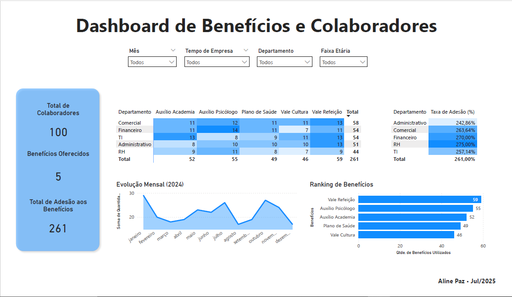
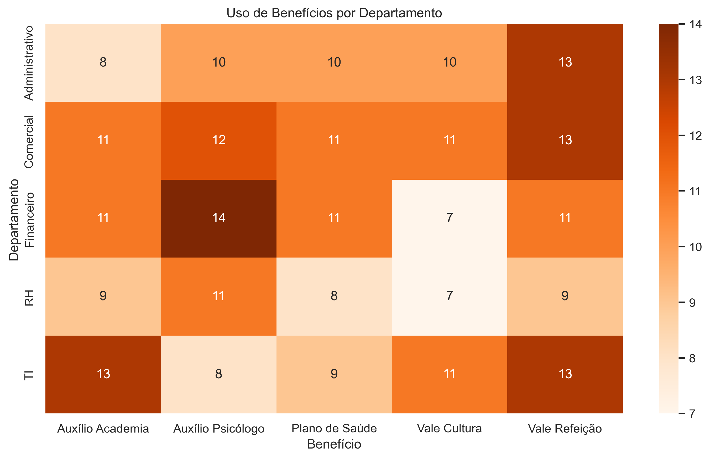
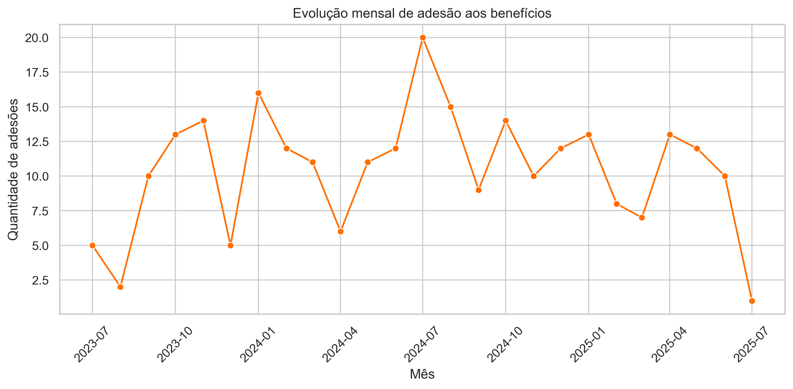

# 📊 Dashboard de Análise de Benefícios

Projeto de análise do programa de benefícios e bem-estar de uma empresa, desenvolvido para fins de aprendizado e portfólio.
Os dados foram anonimizados, tratados e explorados com Python (Pandas, Seaborn, Matplotlib) e visualizados de forma interativa no Power BI.

*OBS.: Os dados são fictícios e representam uma base de colaboradores e seu engajamento com os benefícios oferecidos.*

---

## 🎯 Objetivos do Projeto
- Exibir indicadores de RH e Bem-Estar de forma clara e visual.
- Criar painéis interativos com foco em tomada de decisão para o time de Pessoas.
- Aplicar conceitos de People Analytics e KPIs de engajamento.
- Analisar os dados de adesão para gerar insights estratégicos, otimizar o programa de benefícios e treinar habilidades com ferramentas de dados.

Este é um projeto do meu portfólio como profissional em transição para a área de Dados, com foco em análise visual e interpretação de métricas de negócio. Espero que goste! 💜

---

## 📁 Estrutura do Repositório

```
dashboard-beneficios/
├── 📂 data/                                
|   ├── colaboradores_anonimizados.csv      # Dados anonimizados e prontos para a análise
|   ├── evolucao_mensal_beneficios.csv      # Dados mensais extraídos do Python
│   └── uso_beneficios_anonimizados.csv     # (e outros arquivos de dados tratados)
│
├── 📂 powerbi/
│   ├── dashboard_beneficios.pbix           # Arquivo do dashboard criado no Power BI
│   └── painel_powerbi.png                  # Imagem de prévia do painel final
│
├── 📂 python/ 
|   ├── 📂 graficos/                        # Gráficos gerados pela análise exploratória
|   ├── 📂 insights/                        # Insights retirados da análise exploratória
|   └── 📂 notebooks/ 
│       ├── analise_exploratoria.ipynb      # Notebook com toda a análise exploratória
│       └── tratamento_dados.ipynb          # Notebook com dados tratados
| 
├── requirements.txt                        # Dependências para rodar o notebook
└── README.md                               # Documentação completa do projeto
```

---
    
## 🧰 Ferramentas Utilizadas
✅ **Power BI Desktop** — para visualizações interativas, filtros dinâmicos e cálculos DAX.  
✅ **Python (Pandas, Seaborn, Matplotlib)** — para anonimização, tratamento e análise exploratória dos dados.  
✅ **Jupyter Notebook** — ambiente interativo para execução da análise em Python.  

---

## 📈 Funcionalidades do Dashboard
* **KPIs principais:** Total de Colaboradores, Total de Adesões e Média de Benefícios por Colaborador.
* **Filtros por Departamento, Faixa Etária e Tempo de Empresa.**
* **Medidas DAX personalizadas** para cálculo de taxas de engajamento.
* Gráficos dinâmicos e interativos.
* Layout limpo, moderno e organizado para facilitar a leitura dos dados.

---

## 🖼️ Prévia do Dashboard



---

## 📌 Índice de Insights (Extraídos da Análise)
Abaixo estão os principais insights extraídos a partir da análise combinada de Python e Power BI.

1.  **Saúde Mental e Física no Topo:** O Auxílio Psicólogo e o Auxílio Academia apresentam altíssima adesão, indicando um forte interesse dos colaboradores por bem-estar holístico.
2.  **Sazonalidade nas Contratações:** Os picos de adesão em Janeiro e Julho estão diretamente ligados aos ciclos de contratação, revelando momentos estratégicos para comunicação e onboarding.
3.  **Padrões por Geração e Departamento:** A análise revelou preferências distintas entre faixas etárias e departamentos. O time de TI lidera o uso do Auxílio Academia, enquanto o Financeiro se destaca no uso do Auxílio Psicólogo.
4.  **Engajamento por Tempo de Empresa:** Identificamos uma queda no engajamento com benefícios para colaboradores entre 1 e 2 anos de casa, sugerindo uma oportunidade para campanhas de reengajamento.

---

## 📘 Detalhes da Versão Power BI
O painel desenvolvido no Power BI tem como foco a visualização clara e interativa dos dados de benefícios. Foram utilizados elementos visuais modernos e filtros dinâmicos para melhorar a experiência do usuário e facilitar a geração de insights.

**KPIs incluídos:**
- 👥 Total de Colaboradores
- 📈 Total de Adesão aos Benefícios
- 📊 Média de Benefícios por Colaborador (Medida DAX)
- 💹 Taxa de Adesão (%) (Medida DAX)

**Gráficos utilizados:**
- 🔥 **Matriz com Mapa de Calor** (Uso de Benefícios vs. Departamento)
- 📉 **Gráfico de Linhas** (Evolução Mensal de Adesões)
- 📊 **Gráfico de Barras** (Ranking dos Benefícios Mais Utilizados)

**Interatividade:**
- 🔘 **Segmentações** por Departamento, Faixa Etária e Tempo de Empresa.
- 🔄 **Interações cruzadas** entre todos os gráficos e KPIs.

**📎 Arquivo:** `powerbi/dashboard_beneficios.pbix`

---

## 📙 Detalhes da Versão Python
A etapa em Python foi responsável pela preparação e análise inicial dos dados. Utilizei bibliotecas como Pandas, Seaborn e Matplotlib para anonimizar, tratar, gerar visualizações e insights preliminares.

**Bibliotecas utilizadas:**
- `pandas` para manipulação e tratamento de dados.
- `matplotlib` e `seaborn` para visualizações estáticas.

**Análises realizadas:**
- 🎭 Anonimização dos dados para garantir a privacidade.
- 🧹 Limpeza e tratamento dos datasets.
- 📍 Distribuição de colaboradores por departamento.
- 📊 Geração dos gráficos base que inspiraram o dashboard final.

## 📌 Índice de Insights (Extraídos da Análise Exploratória no Python)

Abaixo estão os 3 principais insights extraídos a partir da análise exploratória com Python, que serviram como base para a construção do dashboard interativo em Power BI.

---

### 1. O Ranking Geral: Bem-Estar é Prioridade


A análise dos benefícios mais utilizados revelou uma forte tendência: além do essencial (Vale Refeição), os benefícios de bem-estar como **Auxílio Psicólogo** e **Auxílio Academia** estão entre os mais populares, mostrando que a saúde mental e física é uma prioridade clara para os colaboradores.

---

### 2. O Mapa de Preferências: Cada Departamento com seu Perfil



O mapa de calor demonstrou que o engajamento com os benefícios varia significativamente entre os departamentos. O time de **TI**, por exemplo, lidera a adesão ao Auxílio Academia, enquanto a equipe **Financeira** mostra uma afinidade maior com o Auxílio Psicólogo. Isso permite a criação de campanhas de comunicação direcionadas.

---

### 3. A Análise Temporal: O Ritmo do Negócio



O gráfico de evolução de adesões ao longo do tempo mostrou uma clara sazonalidade, com picos em **Janeiro e Julho**. Este padrão está fortemente correlacionado aos principais ciclos de contratação da empresa, indicando os melhores momentos para reforçar a comunicação sobre o programa de benefícios.

---

E abaixo estão os principais pontos analisados no projeto. Cada item leva a uma página com a explicação detalhada, o gráfico correspondente e a conclusão extraída.

- [Distribuição de Colaboradores por Departamento](python/insights/colaboradores_por_departamento.md): Entenda a estrutura da empresa e o tamanho de cada time.

- [Ranking de Popularidade dos Benefícios](python/insights/beneficios_mais_utilizados.md): Descubra quais benefícios são os mais valorizados e a forte tendência de bem-estar.

- [Análise de Uso por Departamento](python/insights/uso_beneficios_departamento.md): Veja como diferentes departamentos têm perfis de uso distintos para cada benefício.

- [Análise de Uso por Faixa Etária](python/insights/uso_beneficios_idade.md): Explore os padrões de engajamento através das diferentes gerações de colaboradores.

- [Análise por Tempo de Empresa](python/insights/uso_beneficios_tempo_empresa.md): Descubra como a relação com os benefícios muda ao longo da jornada do colaborador.

- [Sazonalidade na Adesão aos Benefícios](python/insights/evolucao_mensal_beneficios.md): Identifique os picos de adesão e sua conexão com os ciclos de contratação.

---

**📜 Para instalar as dependências, utilize o `requirements.txt`:**
1. Acesse a pasta `python/`
2. Instale as dependências:
   ```bash
   pip install -r requirements.txt
   ```
3. Execute o notebook ou scripts disponíveis para visualizar os gráficos e análises geradas.

📎 Notebooks e scripts: `python/notebooks/`  
📜 Dependências: `python/requirements.txt`

---

## 👩‍💻 Sobre a Autora

Desenvolvido por **[Aline Paz](https://github.com/alinepax)**  
📫 Me encontre no [LinkedIn](https://www.linkedin.com/in/alinedapaz/)  
📧 Email para parcerias: aline.santospaz@gmail.com  
🎯 Este projeto faz parte do meu portfólio como profissional em transição para a área de Dados e Tecnologia.

---

⭐ Se você gostou, deixe uma estrela no repositório!

---

## 📄 Licença

Este projeto está licenciado sob os termos da **[Licença MIT](https://opensource.org/licenses/MIT)**.  
Sinta-se à vontade para usar, modificar e compartilhar com os devidos créditos.
