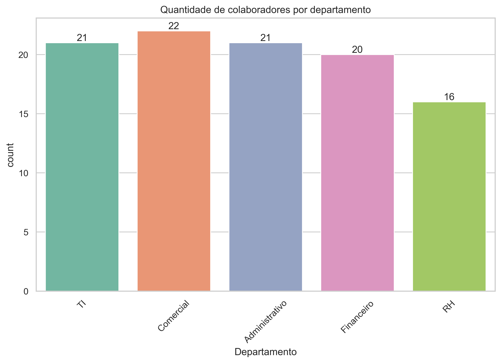

### Um Olhar Rápido na Nossa Equipe! 👀

Analisando nosso gráfico, temos um insight super legal sobre a distribuição dos times:

* **Equilíbrio é tudo!** ⚖️ Nossos departamentos de `TI`, `Comercial`, `Administrativo` e `Financeiro` são quase do mesmo tamanho. Isso significa que podemos lançar um benefício novo e o impacto será sentido de forma bem parecida por quase toda a galera!

* **RH: Nosso laboratório de ideias!** 🧪 Sendo nosso menor time, o `RH` é o grupo perfeito para testar em primeira mão aquele benefício inovador que estamos planejando. Um piloto de sucesso com eles é o primeiro passo para um lançamento incrível para toda a empresa! 🚀✨
