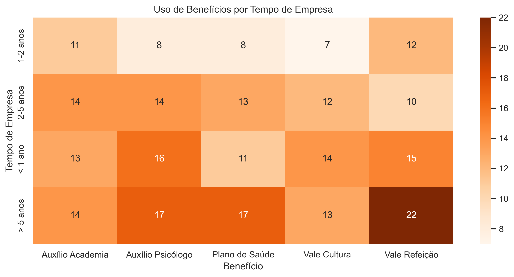

### A Jornada do Colaborador e Seus Benefícios! 🗺️

Este mapa mostra que a relação do time com os benefícios se transforma ao longo do tempo na empresa. Cada fase tem uma prioridade diferente!

* **Boas-vindas com Foco em Saúde Mental!** 🧠✨
    Este é um achado incrível! Para os recém-chegados (`< 1 ano`), o `Auxílio Psicólogo` é o segundo benefício mais popular. Isso indica que os novos talentos já chegam valorizando o suporte ao bem-estar mental, tornando nosso programa um diferencial competitivo desde o primeiro dia.

* **Veteranos (> 5 anos): A Base Sólida!** 🏆🛡️
    Nossos colaboradores mais antigos são a prova de que o tradicional tem muito valor. Eles são os maiores usuários do `Vale Refeição` e do `Plano de Saúde`. A altíssima adesão a estes dois benefícios mostra que eles são essenciais para a segurança, o conforto e a retenção de talentos a longo prazo.

* **Alerta de Engajamento no 2º Ano!** 📉❓
    Notamos uma queda expressiva no uso de benefícios no grupo de `1 a 2 anos` de casa. Este é um ponto de atenção crítico! Será um reflexo da "crise do segundo ano", um fenômeno conhecido de queda de engajamento após o período inicial de euforia? É o momento perfeito para lançar uma campanha de reengajamento, reforçando o valor e as possibilidades do nosso pacote de benefícios.
